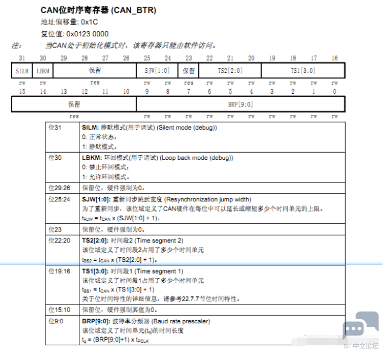
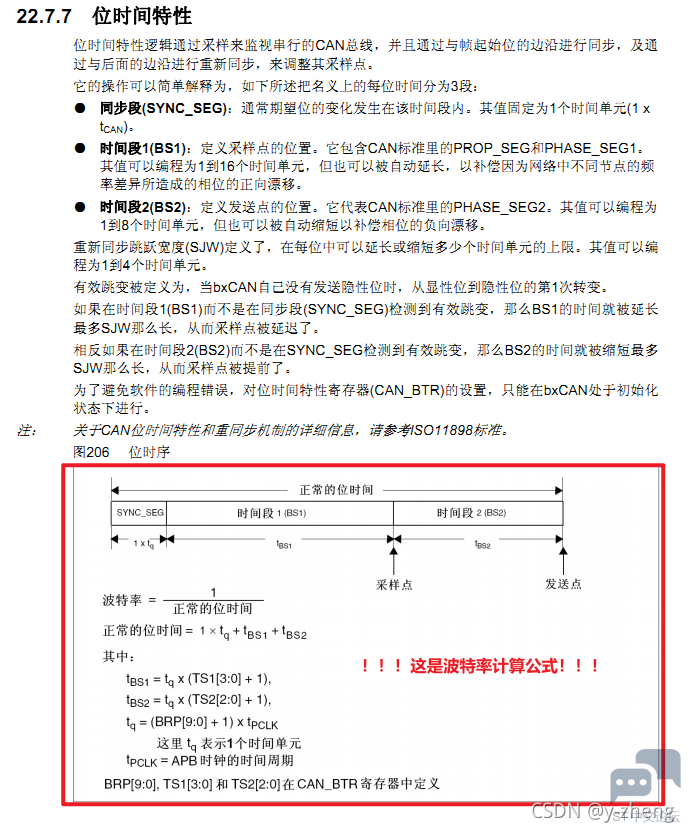
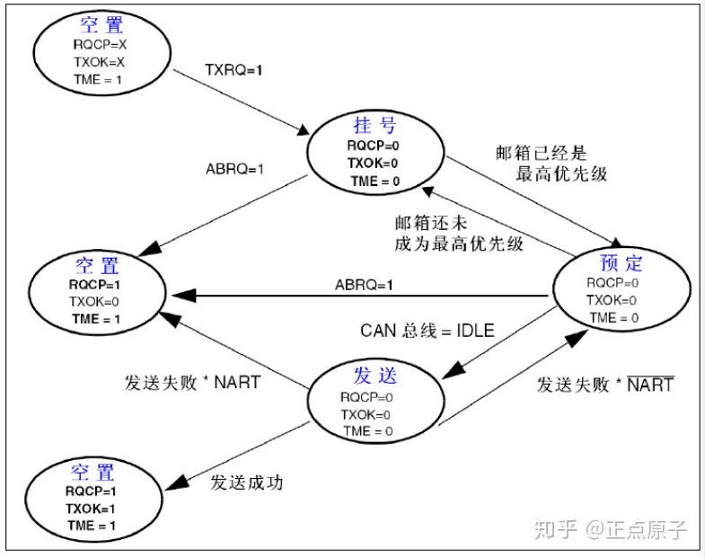
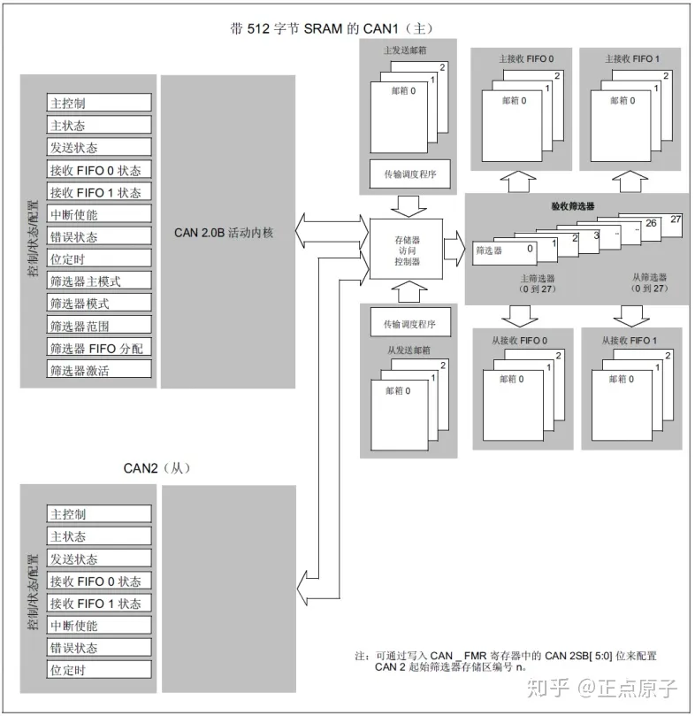
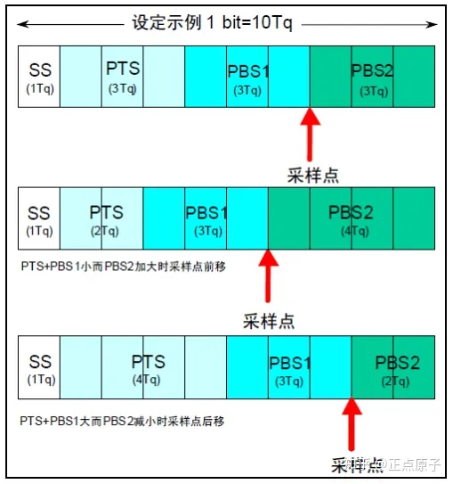
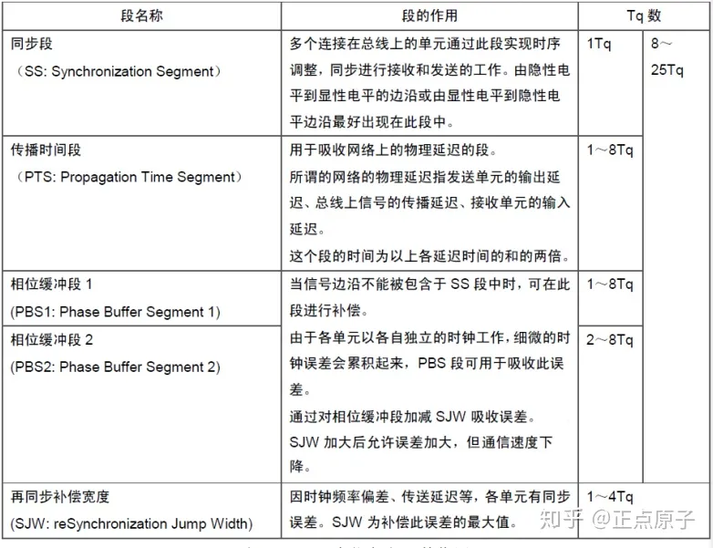
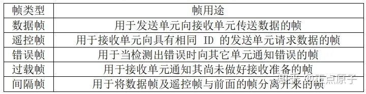

**先了解几个关键词简称：** 

最小时间单位（Tq，Time Quantum） 

同步段（SS，Synchronization Segment）1tq 

传播时间段（PTS，Propagation Time Segment）1~8tq 

相位缓冲段1（PBS1，Phase Buffer Segment1）1~8tq 

相位缓冲段2（PBS2，Phase Buffer Segment2）2~8tq 

再同步补偿宽度（SJW，reSynchronization Jump Width）1~4tq 

波特率分频器（BRP，Baud Rate Prescaler）

 STM32把传播时间段(PTS)和相位缓冲段1(PBS1)合并了，形成了时间段1（TS1）。  CAN位时序寄存器（CAN_BTR）用于设置TS1、TS2、BRP、SJW等参数，这些参数直接决定CAN的波特率。  

  

SJW[1:0]再同步补偿宽度  

TS1[3:0]时间段1  

TS2[2:0]时间段2  

BRP[9:0]波特率分频器  

**可以看到没有同步段(SS段)，这是因为STM32已经将SS段固化为1。**  下面这张图是波特率计算公式：

整合一下波特率计算公式就是这样的：  

波特率 = APB1 / [(1 + (TS1+1) + (TS2+1)) * (BRP+1)]  

简化就是：波特率 = 时钟主频 / 分频 / （tq1 + tq2 + ss）  

其中SS就是同步段，已经恒为1，所以：波特率 = 时钟主频 / 分频 / （tq1 + tq2 + 1） 

这里要注意，CAN的波特率最大为1Mbps。

另外还有一个参数是：再同步补偿宽度(reSynchronization Jump Width) 这个参数，其实就是一个由数个Tq组成的一个段，用来对同步误差进行补偿，可以简单理解为为了提高精准度的，例如两个CAN进行通讯时由于两个板子的晶振可能存在误差从而导致CAN的波特率没有那么精准，所以就需要设置一个补偿参数去修正，这个参数就需要根据你实际的板子情况去调整了。

---

