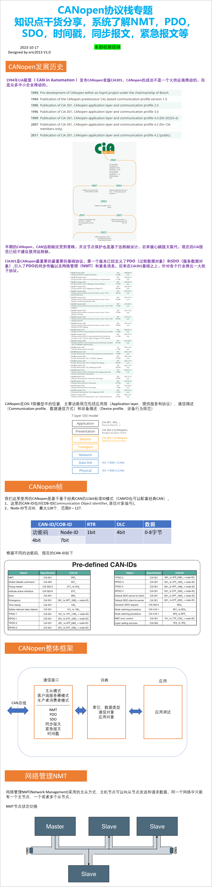
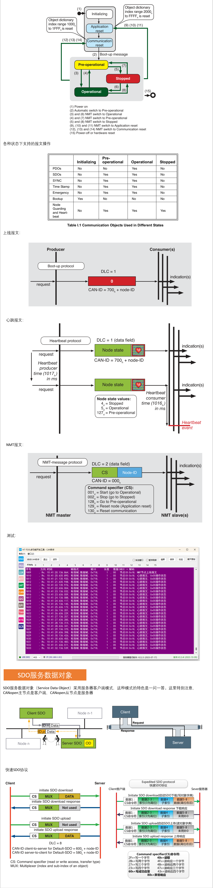
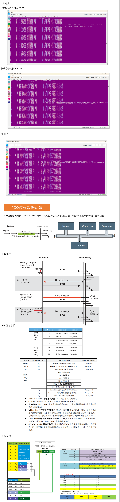
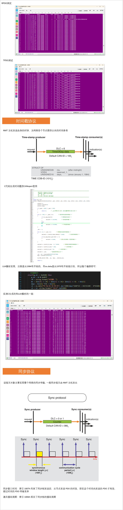
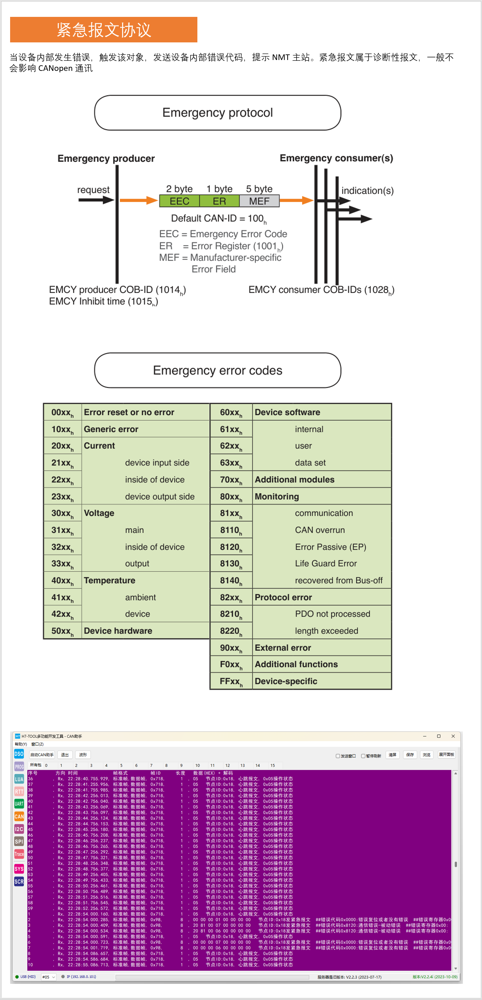

[安富莱](https://www.armbbs.cn/forum.php?mod=viewthread&tid=121438&page=1#pid291300)  [CiA 联盟文档](https://www.can-cia.org/groups/specifications/)

本期视频教程为大家分享CANopen协议栈相关知识内容，涉及到的内容非常多。   **视频教程：**  https://www.bilibili.com/video/BV1Vw411w7Dd     **视频提纲：**            

#### PDO 使用：

① 使用帧 0x600+ID 往 0x1A00 写入映射。0x1A00 有 3个子索引，即可配置 3个映射地址。映射对象的格式：主索引+子索引+数据大小。

② 接收到帧 ID 为 0x1400+ID 的 RPDO 时，会根据对象 0x1A00 里配置目标对象映射数据大小对数据帧字节进行拆解，然后存放相应的映射地址。

