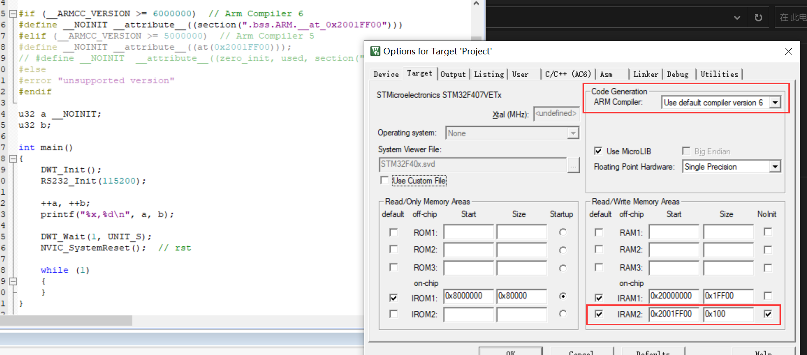
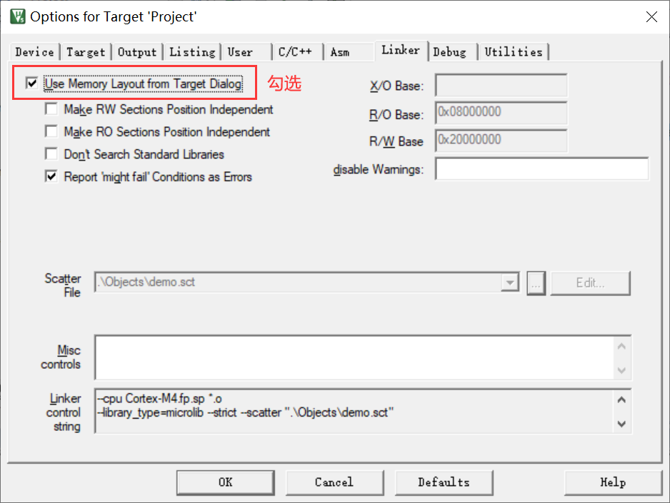
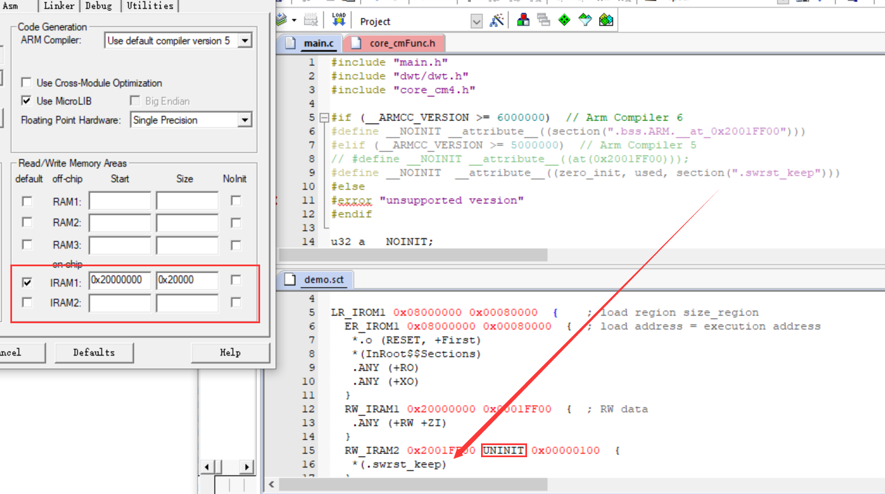
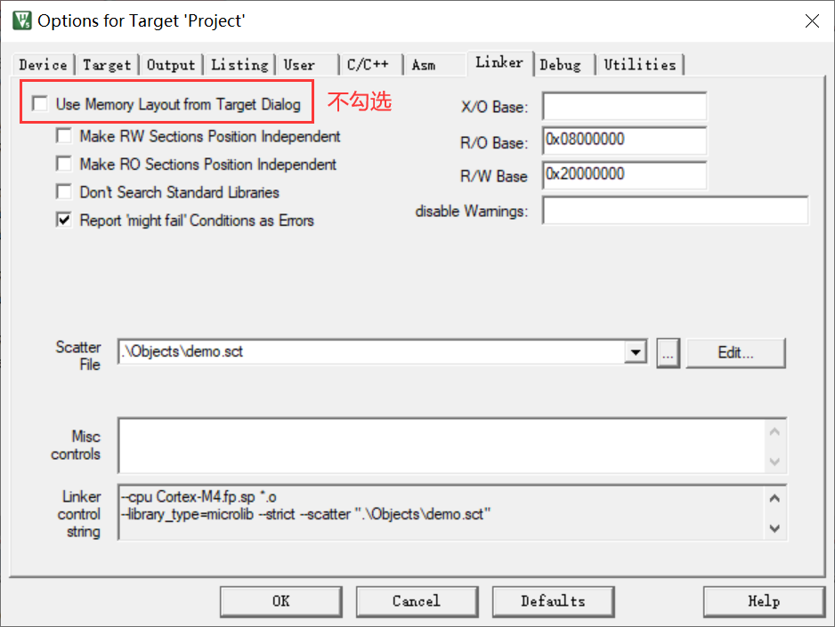

## 软复位不重置变量

* 方法 1

分配 RAM 段，勾选 NoInit（注意 at 地址）





* 方法 2

默认即可：



自定义 SCT（注意段名）：



```
LR_IROM1 0x08000000 0x00080000  {    ; load region size_region
  ER_IROM1 0x08000000 0x00080000  {  ; load address = execution address
   *.o (RESET, +First)
   *(InRoot$$Sections)
   .ANY (+RO)
   .ANY (+XO)
  }
  RW_IRAM1 0x20000000 0x0001FF00  {  ; RW data
   .ANY (+RW +ZI)
  }
  RW_IRAM2 0x2001FF00 UNINIT 0x00000100  {
   *(.swrst_keep)
  }
}

```

