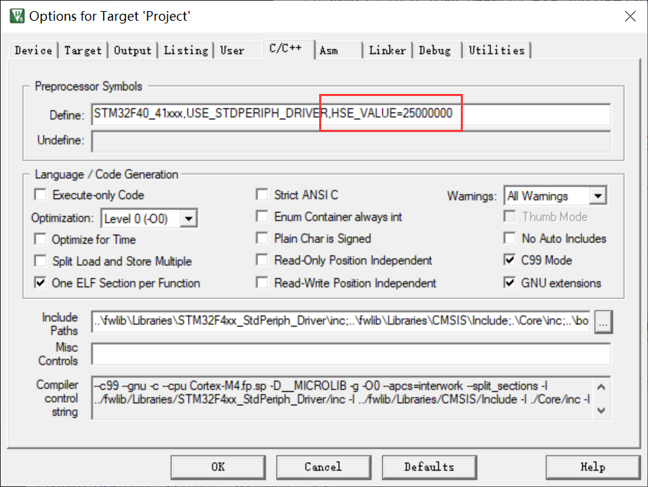
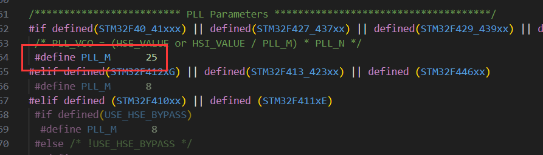

① 不添加源文件 `stm32f4xx_fms.c`

② 出现串口输出乱码：

在 `stm32f4xx.h` 设置 `HSE_VALUE` 为外部晶振实际值。

为 8MHz  则设置 8000000， 为 25MHz 则设置 25000000。


或者在 keil 中添加全局宏定义：

```
HSE_VALUE=8000000
HSE_VALUE=25000000
```



③ DWT 延时时间不正确

若系统实际运行频率不为 168MHz（ HSE 在 `main()` 之前已自动配置 ）

```c
#include "stm32f4xx.h"

u32 GetSysClk(void)
{
    RCC_ClocksTypeDef clocks;
    RCC_GetClocksFreq(&clocks);
    return clocks.SYSCLK_Frequency;
}
```

需更改 `system_stm32f4xx.c` 的 `PLL_M` 。外部晶振为 8MHz 的改为 8，25MHz 的改为 25。

